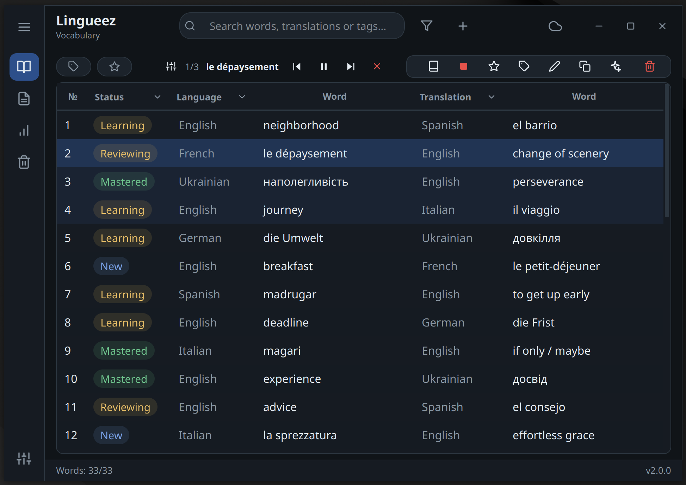

**🇬🇧 English** &nbsp;·&nbsp; [🇺🇦 Українська](README.uk.md)

# Lingueez

**[lingueez.app](https://lingueez.app)**

A desktop app for building, studying, and remembering vocabulary across languages.

Add words and they translate automatically; listen to them on repeat and watch each
one climb from *New* to *Mastered* as you do; review them with spaced-repetition
flashcards; read whole texts with side-by-side translations and synced audio; and
keep everything in sync across devices.

## Features

- **Words** — add, edit, and organize entries with statuses, favorites, tags, and
  two definition fields.
- **Learning progression** — words advance *New → Reviewing → Learning → Mastered*
  as you listen, with configurable listen thresholds.
- **Flashcards** — spaced-repetition review (SM-2): build a deck from due cards, a
  filter, or selected words; grade yourself *Hard / Good / Easy* with scheduled-interval
  previews — or play the deck as audio and let the cards flip in sync with the voice.
- **Search & filters** — live search across words, translations, and tags; filter by
  language, status, tag, or favorites.
- **Translation** — Google Translate, with optional DeepL integration.
- **AI assistance** — OpenAI or Gemini for definitions and generated study texts.
- **Audio** — read-aloud with adjustable pauses and repeats, MP3
  export, and a floating mini-player when the window is minimized.
- **Texts reader** — import from files, the web, Wikipedia, or RSS; read with a
  side-by-side translation and word highlighting synced to playback
  ([screenshot](screenshots/texts.png)).
- **Statistics** — a dashboard with status distribution, streaks, definition
  coverage, and progress over time ([screenshot](screenshots/statistics.png)).
- **Import & export** — Excel import with duplicate detection; export to PDF, Excel,
  CSV, **Anki**-friendly TXT and MP3.
- **Sync & backups** — two-way cloud sync, a bin to restore deleted items, and
  automatic daily backups with retention.

API keys and preferences are all managed inside the app under **Settings**.

## Keyboard shortcut

A global hotkey (**Ctrl+Shift+V** by default, configurable in **Settings**) adds a
word straight from the clipboard and translates it.

## Support

Lingueez is free and open-source, with no paywalls. If you enjoy Lingueez and
find it useful, a one-off contribution helps cover the servers behind optional
cloud sync and supports continued development:

- **[Support Lingueez's development](https://buy.stripe.com/14A8wRd41a8f1aI6rw43S02)** — one-time, no subscription (card / Apple Pay / Google Pay).
- **[GitHub Sponsors](https://github.com/sponsors/lysak-yurii)** — for developers; recurring or one-off.

## Contributing

Contributions are welcome. Please read [`CONTRIBUTING.md`](CONTRIBUTING.md) — all
contributors agree to the [`CLA`](CLA.md) before their changes can be merged.

## License

© Yurii Lysak. Licensed under the **GNU Affero General Public License v3.0**
([`LICENSE.txt`](LICENSE.txt)) — you may use, study, share, and modify it, and any
distributed version (including over a network) must remain open under the same
license.

Under AGPL-3.0 section 7, one additional term applies: forks and derivative works
must keep the author attribution (*"Lingueez — created by Yurii Lysak"*) visible in
the program's user-facing notices. See the [`NOTICE`](NOTICE) file for details.

Bundled third-party components keep their own licenses; see
[`THIRD-PARTY-LICENSES.md`](THIRD-PARTY-LICENSES.md).
