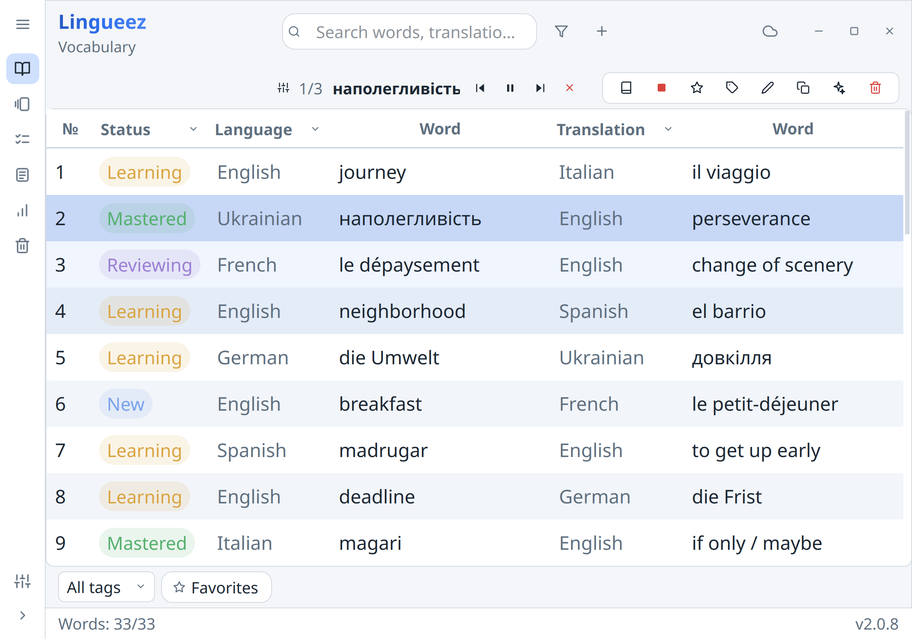

**🇬🇧 English** &nbsp;·&nbsp; [🇺🇦 Українська](docs/i18n/README.uk.md)

# Lingueez

**[lingueez.app](https://lingueez.app)**

A desktop app for building, studying, and remembering vocabulary across languages.

Add words and they translate automatically; listen to them on repeat and watch each
one climb from *New* to *Mastered* as you do; review them with spaced-repetition
flashcards or quiz yourself on them; read whole texts with side-by-side
translations and synced audio; and keep everything in sync across devices.

<picture>
  <source media="(prefers-color-scheme: dark)" srcset="docs/assets/shots/words-dark.png">
  
</picture>

## Get Lingueez

| | |
|---|---|
| **Windows** | [Microsoft Store](https://apps.microsoft.com/detail/9pkdjkgvzt6v) (`winget install 9PKDJKGVZT6V`), or the installer from [Releases](https://github.com/lysak-yurii/lingueez/releases/latest) |
| **Linux** | AppImage or Flatpak bundle from [Releases](https://github.com/lysak-yurii/lingueez/releases/latest) |
| **Android** | [Google Play](https://play.google.com/store/apps/details?id=app.lingueez.mobile) — the companion app, syncing the same vocabulary |
| **Browser** | [web.lingueez.app](https://web.lingueez.app/) |
| **E-reader** | [KOReader plugin](https://lingueez.app/koreader/) — long-press a word while you read and it lands in your vocabulary |

All of it is free, and nothing needs an account: sign in only if you want sync.

## Features

- **Words** — add, edit, and organize entries with statuses, favorites, tags, and
  two definition fields.
- **Learning progression** — words advance *New → Reviewing → Learning → Mastered*
  as you listen, with configurable listen thresholds.
- **Flashcards** — spaced-repetition review (SM-2): build a deck from due cards, a
  filter, or selected words; grade yourself *Hard / Good / Easy* with scheduled-interval
  previews — or play the deck as audio and let the cards flip in sync with the voice
  ([screenshot](docs/assets/shots/flashcards-light.png)).
- **Quiz** — test yourself on your own words: multiple choice or a typed answer,
  in either direction, with the definition and an example when you get it right
  ([screenshot](docs/assets/shots/quiz-choices-light.png)).
- **Search & filters** — live search across words, translations, and tags; filter by
  language, status, tag, or favorites.
- **Translation** — Google Translate, with optional DeepL integration.
- **Languages** — 32 interface languages, 105 you can add words and texts in, and
  65 with text-to-speech ([full list](LANGUAGES.md)).
- **AI assistance** — OpenAI or Gemini for definitions and generated study texts.
- **Audio** — read-aloud with adjustable pauses and repeats, MP3
  export, and a floating mini-player when the window is minimized.
- **Texts reader** — import from files, the web, Wikipedia, or RSS; read with a
  side-by-side translation and word highlighting synced to playback
  ([screenshot](docs/assets/shots/texts-light.png)).
- **Statistics** — a dashboard with status distribution, streaks, definition
  coverage, and progress over time ([screenshot](docs/assets/shots/stats-light.png)).
- **Import & export** — Excel import with duplicate detection; export to PDF, Excel,
  CSV, **Anki**-friendly TXT and MP3.
- **Sync & backups** — two-way cloud sync, a bin to restore deleted items, and
  automatic daily backups with retention.

API keys and preferences are all managed inside the app under **Settings**.

## Keyboard shortcut

A global hotkey (**Ctrl+Shift+V** by default, configurable in **Settings**) adds a
word straight from the clipboard and translates it.

## Support

Lingueez is free and open-source, with no paywalls. If you enjoy Lingueez and
find it useful, a one-off contribution helps cover the servers behind optional
cloud sync and supports continued development:

- **[Support Lingueez's development](https://buy.stripe.com/14A8wRd41a8f1aI6rw43S02)** — one-time, no subscription (card / Apple Pay / Google Pay).
- **[GitHub Sponsors](https://github.com/sponsors/lysak-yurii)** — for developers; recurring or one-off.

## Contributing

Contributions are welcome. Please read [`CONTRIBUTING.md`](.github/CONTRIBUTING.md) — all
contributors agree to the [`CLA`](.github/CLA.md) before their changes can be merged.

## License

© Yurii Lysak. Licensed under the **GNU Affero General Public License v3.0**
([`LICENSE.txt`](LICENSE.txt)) — you may use, study, share, and modify it, and any
distributed version (including over a network) must remain open under the same
license.

Under AGPL-3.0 section 7, one additional term applies: forks and derivative works
must keep the author attribution (*"Lingueez — created by Yurii Lysak"*) visible in
the program's user-facing notices. See the [`NOTICE`](NOTICE) file for details.

Bundled third-party components keep their own licenses; see
[`THIRD-PARTY-LICENSES.md`](THIRD-PARTY-LICENSES.md).
